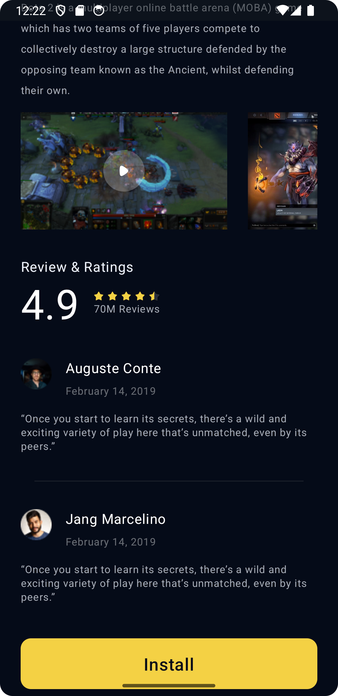

# DotaApp
Training app for mobile development course. This app has only one screen with two sections. The first secection is about banner, icon, rating and description of game. The second consists of users' comments.   
This app doesn't have any functionality, just UI.

How to launch

- Open Android Studio and select File->Open... or from the Android Launcher select Import project (Gradle, etc.) and navigate to the root directory of your project.
- Select the directory or drill in and select the file build.gradle in the cloned repo.
- Click 'OK' to open the the project in Android Studio.
- A Gradle sync should start, but you can force a sync and build the 'app' module as needed.

